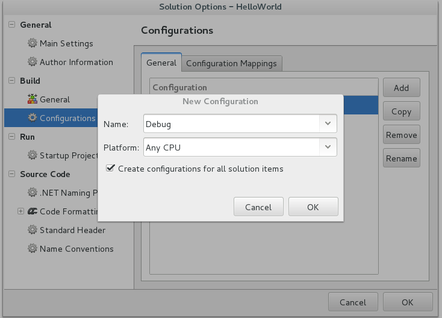

#Hello World!

## Introduction

This repository contains the project files, source code and compiled binaries
for a basic .net app that can be deployed through Resin.io.

The provided Dockerfile installs the mono-runtime package and .net 2.0
support libraries. That is all that's required to run a simple program like
this. You will quickly find out though that by expanding the functionality
in this sample program, that additional library packages are required.
You can review our other examples on github for examples of running more
sophisticated code.

For simplicity, we have put everything in one repository for this first
example. That is, the entire source tree is in the repo, but you don't really
need this for the deployment and it isn't used at runtime - it just makes for
an easier sample set up. One of the more advanced examples will show how to use
separate source and deployment repositories resulting in a better devops
workflow.

## Requirements

You should have 

* Raspberry Pi or Raspberry Pi 2 with power, networking (wifi or ethernet),
and a suitable SD card
* An installation of mono-complete on Windows, Apple OSX, or Linux (PC or
on a Raspberry Pi). We'll use
monodevelop to create, edit and compile our project. You can also use Visual
Studio, though it is more complex to set up in a way that is mono-friendly.
I may cover that in a later example. Theoretically, you could also use the msc
command-line compiler, but explaining all of the options to get a correct 
compile is beyond the scope of this example.

## Resin.io Setup

1. If you haven't got a [Resin.io](http://resin.io) account, visit
[resin.io](http://resin.io) and sign up.
1. Start a new applicaton on [Resin.io](http://resin.io) and follow the
directions for your target device type to load the image onto your SD card.
1. Insert the SD card into the Raspberry Pi, power it up and wait for it
to connect to the internet and resin.io.
1. After about 10 minutes your new device should show up on your application 
dashboard.

## Running the example code

1. You can now clone the HelloWorld repo:

```sh
$ git clone https://github.com/nghiant2710/hello.NET.git
```

Then add the resin remote. You can find an example of this command and 
and a copyable link with your username and application name by clicking
on your application on the resin.io dashboard. The information you need
is at the top right next to the Need Help? button:

```sh
$ git remote add resin git@git.resin.io:<yourUserName>/<yourApplicationName>.git
```

And finally push the code to your Raspberry Pi:

`$ git push resin master`

You should see a unicorn. Honest. Go to the resin.io dashboard; select
your application; select your test device; and click on "Logs". At the end of
the deployment process, you should see a simple "Hello World!" in the logs.

## Reproducing the sample from scratch

1. Run monodevelop and create a new project. For simplicity, I created
my project right in the deployment repository, but that's only because it
makes it easier to package the sample. In practice, you will want a separate
git repo for your source code, and then just copy the binaries into your
deployment repo. You can run monodevelop on any platform (Windows, Mac, 
Linux) - it does not have to be run on a Raspberry Pi. For this sample, 
I worked from a PC running Debian.
1. Create a new project. You should create a command-line project. The 
default command-line project is a hello world program, so we don't have
to edit any code.
1. We do have to change some options though. Firstly, right-click on the
solution (not the project, but the top-level solution) and select 'options'.
1. Select 'Configurations' and then click on 'Debug|XXXXX'
1. Click on 'Copy' and enter the name 'Debug' and select a platform of 'Any CPU'
It should look like this:


## Key Points

* Your .net programs must either be developed on the same platform (a 
Raspberry Pi or Pi 2) or developed with a platform target of "Any CPU"
which generates platform-agnostic code. This is always my preferred option
so that I do not need separate binary images for every target platform.
The only time you cannot use Any CPU is when you are using PInvoke to call
external native-code libraries with platform-dependent calling conventions.
* As you expand your code, you will need to change the Dockerfile to include
more or different packages. This is covered in Example 2.

## Diagnostics
