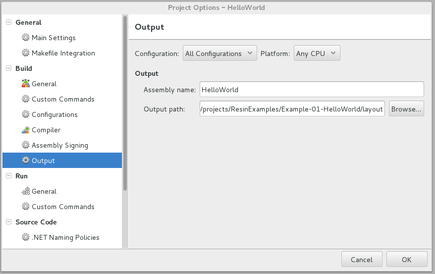

#Hello World!

## Introduction

This repository contains the project files, source code and compiled binaries
for a basic .net app that can be deployed through Resin.io.

The provided Dockerfile installs the mono-runtime package and .net 2.0
support libraries. That is all that's required to run a simple program like
this. You will quickly find out though that by expanding the functionality
in this sample program, that additional library packages are required.
You can review our other examples on github for examples of running more
sophisticated code.

For simplicity, we have put everything in one repository for this first
example. That is, the entire source tree is in the repo, but you don't really
need this for the deployment and it isn't used at runtime - it just makes for
an easier sample set up. One of the more advanced examples will show how to use
separate source and deployment repositories resulting in a better devops
workflow.

## Requirements

You should have 

* Raspberry Pi or Raspberry Pi 2 with power, networking (wifi or ethernet),
and a suitable SD card
* An installation of mono-complete on Windows, Apple OSX, or Linux (PC or
on a Raspberry Pi). We'll use
monodevelop to create, edit and compile our project. You can also use Visual
Studio, though it is more complex to set up in a way that is mono-friendly.
I may cover that in a later example. Theoretically, you could also use the msc
command-line compiler, but explaining all of the options to get a correct 
compile is beyond the scope of this example.

## Resin.io Setup

1. If you haven't got a [Resin.io](http://resin.io) account, visit
[resin.io](http://resin.io) and sign up.
1. Start a new applicaton on [Resin.io](http://resin.io) and follow the
directions for your target device type to load the image onto your SD card.
1. Insert the SD card into the Raspberry Pi, power it up and wait for it
to connect to the internet and resin.io.
1. After about 10 minutes your new device should show up on your application 
dashboard.

## Running the example code

You can deploy the unaltered example code just to see it run on your device.
To do so, follow these steps...  Below, we will walk through creating a new
.net Hello World project from scratch.

1. Clone the HelloWorld repo:

```sh
$ git clone https://github.com/ResinIoDotNetExamples/Example-01-HelloWorld.git
```

Add the resin remote. You can find an example of this command and 
and a copyable link with your username and application name by clicking
on your application on the resin.io dashboard. The information you need
is at the top right next to the Need Help? button:

```sh
$ git remote add resin git@git.resin.io:<yourUserName>/<yourApplicationName>.git
```

And finally push the code to your Raspberry Pi:

`$ git push resin master`

You should see a unicorn. Honest. Go to the resin.io dashboard; select
your application; select your test device; and click on "Logs". At the end of
the deployment process, you should see a simple "Hello World!" in the logs.

## Reproducing the sample from scratch

1. Run monodevelop and create a new project. For simplicity, I created
my project right in the deployment repository, but that's only because it
makes it easier to package this as a sample. In practice, you will want a separate
git repo for your source code, and then just copy the binaries into your
deployment repo. You can run monodevelop on any platform (Windows, Mac, 
Linux) - it does not have to be run on a Raspberry Pi. For this sample, 
I worked from a PC running X86-64 Debian.
1. Create a new project. You should create a 'Console' project. The 
default console project template is a hello world program, so we don't have
to edit any code.
1. We do have to change some options though. Firstly, right-click on the
solution (not the project, but the top-level solution) and select 'options'.
1. Select 'Configurations' and then click on 'Debug|XXXXX'
1. Click on 'Copy' and enter the name 'Debug' and select a platform of 'Any CPU'
It should look like this:

1. Do the same for 'Release'. That is, copy Release|XXXX and create a Release
for the Any CPU platform.
1. Click OK to close the options dialog
1. Right click on the project node and select options again. This time, click
'Output'.
1. Change the Configuration to "All Configurations" and the Platform to "Any
CPU" and set the output path to the directory that you want your output written
into. In my case, I created a 'layout' directory. Note that this is the same
directory that is mentioned in the ADD command in your Dockerfile. Using the
output options (or post-compile Custom Commands) is how you can keep your
source and deployment projects separate.

1. Close the options by clicking OK
1. Select Project->Active Configuration and choose the 'Debug' configuration.
(That should be 'Debug' without any processor/platform specification. We
need to be sure we create a platform agnostic binary using the Any CPU configuration
that we just created)
1. Build the project
1. Commit your changes (including the newly created .exe file - make sure
your .gitignore does not exclude .exe files!)
1. git push resin master
1. Unicorns and "Hello World!" as described above.

## Key Points

* Your .net programs must either be developed on the same platform (a 
Raspberry Pi or Pi 2) or developed with a platform target of "Any CPU"
which will generate platform-agnostic code. This is always my preferred option
so that I do not need separate binary images for every target platform.
The only time you cannot use Any CPU is when you are using PInvoke to call
external native-code libraries with platform-dependent calling conventions.
* As you expand your code, you will need to change the Dockerfile to include
more or different packages. This is covered in Example 2.

## Diagnostics

If your .net program fails to launch or if it exits quickly and unexpectedly,
you cannot use the resin.io terminal to diagnose the problem. The terminal
only works when your application is running and if the application won't start
then you are kind of stuck.

The main reasons for this sort of thing happening are:

* A bad path to your executable in your CMD. For instance, the ADD command
either didn't copy what you thought it did, or your CMD command is referencing
the wrong location. It can be hard to determine which is the real issue without
being able to view the application in the terminal.
* Your .exe won't launch because of a missing library or assembly. That 
could mean that you need to update your Dockerfile to include more mono
packages, or it could mean that
you did not include all the needed assemblies in your deployment project.
* Your .exe launches, but an uncaught exception causes the exe to exit before
you can attach a terminal session.

One way to ensure that you can attach a resin.io terminal session and poke
around is to comment out this line in your Dockerfile:

```Dockerfile
CMD ["mono", "/app/hello/HelloWorld.exe"]
```

and add this line:

```Dockerfile
CMD ["bash"]
```

This will ensure that when you re-deploy your project that 
something is running and you can use the resin.io
terminal to inspect the deployed environment (did everything end up
where you thought it would?) and try to run your program from the command line
and get more diagnostic information if/when it fails.
An alternative is to start a script from the CMD directive and have the script
drop into bash if your program fails to launch. You can use the script as
a failsafe too, to restart your app if it ever exits unexpectedly, or
use the script to launch a parallel watchdog process. We will be using
scripts in later examples to give us access to hardware devices and do
other useful things.
